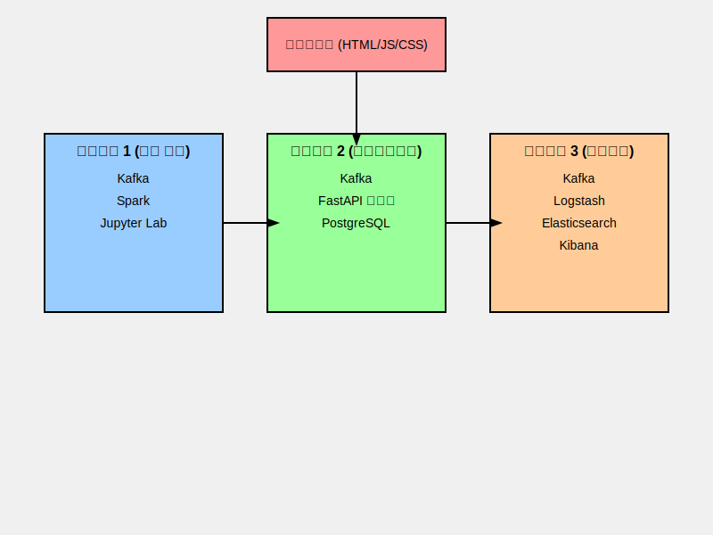

# Netflix 콘텐츠 추천 시스템

## 프로젝트 개요
이 프로젝트는 PySpark를 사용하여 Netflix 데이터셋 기반의 영화 추천 시스템을 구현합니다. FastAPI를 사용한 백엔드 API, 기본적 프론트엔드 인터페이스, ELK 스택을 활용한 모니터링 시스템, 그리고 Kafka를 이용한 실시간 데이터 처리 기능을 포함합니다.

## 시스템 아키텍처



## 주요 기능
- 사용자 장르 선호도 기반 영화 추천
- 장르 기반 필터링
- 실시간 데이터 처리 (Kafka 활용)
- 추천 결과 시각화 (데이터 분석용)
- 로그 및 시스템 모니터링 (ELK 스택 활용)

## 기술 스택
- 백엔드: FastAPI, PySpark
- 프론트엔드: HTML, CSS, JavaScript
- 데이터베이스: PostgreSQL
- 메시지 큐: Apache Kafka
- 데이터 처리: PySpark, Pandas
- 분석 도구: Jupyter Lab
- 모니터링: Elasticsearch, Logstash, Kibana (ELK 스택)

## 프로젝트 구조
```
.
├── 개발 관련
│   ├── 개발환경설치및실행.md
│   └── mermaid.md
├── backend
│   ├── spark
│   │   ├── recommendation_engine.py
│   │   ├── streaming_to_postgres.py
│   │   ├── imdb_movies_shows.csv
│   │   └── netflix_titles.csv
│   ├── kafka
│   └── modify_data
├── pages
│   ├── app.js
│   ├── app.py
│   ├── exam_file.svg
│   ├── Index.html
│   ├── ollama_api.py
│   ├── pages_explain.md
│   ├── recommend.js
│   ├── recommendation-settings.html
│   ├── return_express.js
│   ├── top-20.html
│   ├── top-20.js
│   └── unify.css
├── parquet_data
├── .gitignore
├── netflix-recommendation-architecture.svg
├── README.md
└── requirements.txt
```

## 설치 및 설정 가이드

## 인스턴스 구성

### 인스턴스 1: 데이터 처리 및 분석 서버
- Kafka 클러스터: 실시간 데이터 스트리밍
- Spark: 대규모 데이터 처리
- Jupyter Lab: 데이터 분석가를 위한 대화형 분석 도구

### 인스턴스 2: 애플리케이션 서버
- 프론트엔드: 사용자 인터페이스
- FastAPI 백엔드: RESTful API 제공
- Kafka: 실시간 데이터 처리 및 이벤트 스트리밍
- PostgreSQL: 데이터베이스

### 인스턴스 3: 모니터링 서버
- Kafka: 로그 및 메트릭 수집
- Logstash: 로그 처리 및 변환
- Elasticsearch: 로그 및 메트릭 저장 및 검색
- Kibana: 데이터 시각화 및 모니터링 대시보드

## 의존성

```
# 웹 프레임워크
fastapi==0.109.0
uvicorn==0.27.0

# 파이썬 라이브러리 & 프레임워크
pyspark==3.5.0
pandas==2.2.0
numpy==1.26.3
scikit-learn==1.4.0

# 카프카
kafka-python==2.0.2

# ELK
elasticsearch==7.17.9
elasticsearch-dsl==7.4.1

# DB
sqlalchemy==2.0.25
psycopg2-binary==2.9.9

# API Client
requests==2.31.0

# Async Support for FastAPI
aiohttp==3.9.1

# Jupyter Notebook
jupyter==1.0.0

# 추가 패키지
pyarrow==15.0.0
python-dotenv==1.0.0
pytest==7.4.4
black==23.12.1
flake8==7.0.0
```

[이하 내용 생략...]

## 설치 및 설정 가이드

각 인스턴스별 설정 방법은 다음과 같습니다:

### 인스턴스 1: 데이터 처리 및 분석 서버

1. Java 및 Python 설치
2. Kafka 클러스터 설정
3. Spark 설치 및 구성
4. Jupyter Lab 설치 및 설정

### 인스턴스 2: 애플리케이션 서버

1. Python 및 필요한 라이브러리 설치
2. FastAPI 애플리케이션 설정
3. 프론트엔드 파일 배포
4. Kafka 클라이언트 설정

### 인스턴스 3: 모니터링 서버

1. Java 설치
2. ELK 스택 (Elasticsearch, Logstash, Kibana) 설치 및 구성
3. Logstash 파이프라인 설정 (Kafka에서 데이터 수집)

각 인스턴스의 상세한 설정 방법은 해당 디렉토리의 README 파일을 참조하세요.

## 실행 방법

1. 각 인스턴스의 서비스 시작 (Kafka, Spark, ELK 스택 등)
2. FastAPI 애플리케이션 실행
3. 브라우저에서 프론트엔드 접속

## 개발자 가이드

- 코드 스타일: Black 및 Flake8을 사용하여 일관된 코드 스타일 유지
- 테스트: Pytest를 사용한 단위 테스트 및 통합 테스트 구현
- 문서화: 각 주요 함수 및 클래스에 대한 문서 문자열(docstring) 작성

## 기여 방법

프로젝트에 기여하고 싶으신 분들은 CONTRIBUTING.md 파일을 참조해 주세요.

## 라이센스

이 프로젝트는 MIT 라이센스 하에 배포됩니다. 자세한 내용은 LICENSE 파일을 참조하세요.