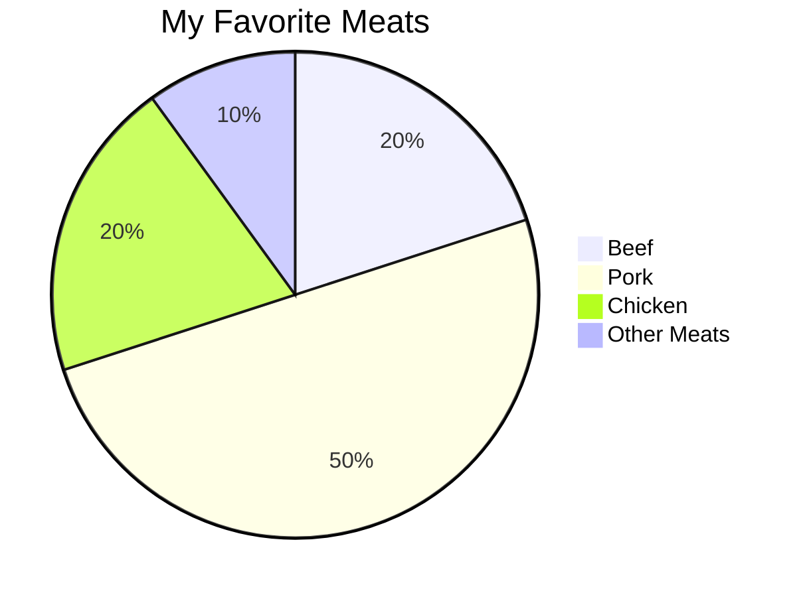

# sakdlfjlasdf

- 

Sure, here's an example of a Markdown file with a Mermaid chart:

```mermaid
pie title My Favorite Meats
    "Beef": 20
    "Pork": 50
    "Chicken": 20
    "Other Meats": 10
```

Feel free to modify the chart data and title to fit your needs. Let me know if you need any further assistance!